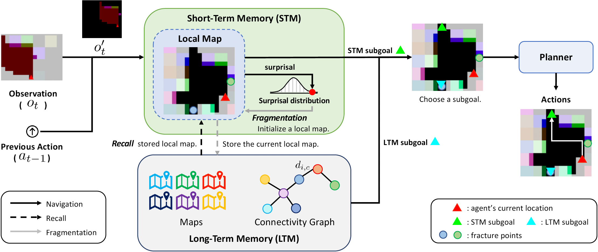

# Grid Cell-Inspired Fragmentation and Recall for Efficient Map Building
Official implementation for **[Grid Cell-Inspired Fragmentation and Recall for Efficient Map Building (FARMap)]()**.


<p align="center">
  
</p>


## Run Experiments
### Setup
```
pip install -r requirements.txt
```


### (Optional) Environment Generation
```
python3 environment_generation/generator.py
```


### Exploration


```
python3 run_exp.py -wandb -env $ENV_ID
```


## Citation
```
@article{hwang2023grid,
    author = {Jaedong, Hwang and Hong, Zhang-Wei and Chen, Eric and Boopathy, Akhilan and Agrawal, Pulkit and Fiete, Ila},
    title = {Grid Cell-Inspired Fragmentation and Recall for Efficient Map Building},
    journal={arXiv preprint arXiv:2307.05793},
    year = {2023},
}   
```
